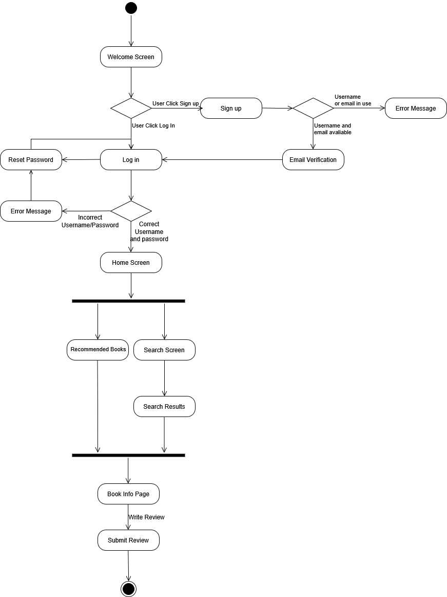
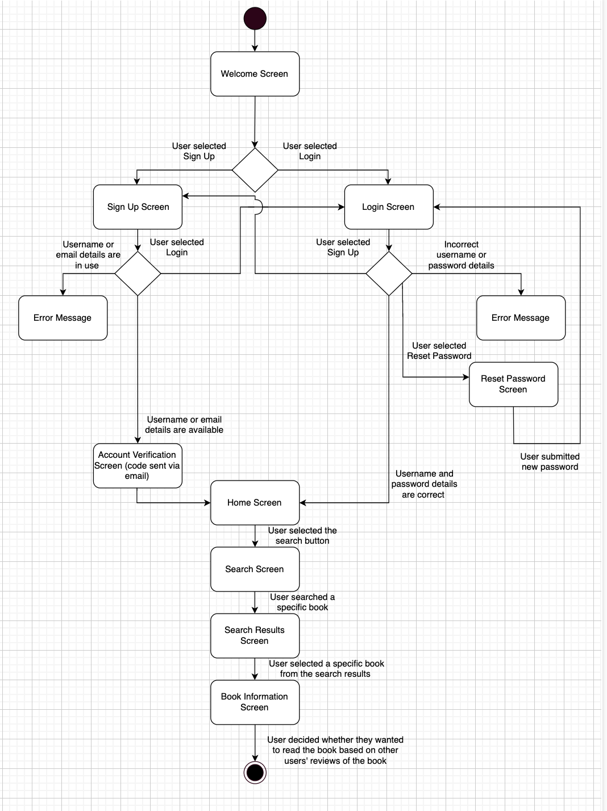

# Specification Phase Exercise

A little exercise to get started with the specification phase of the software development lifecycle. See the [instructions](instructions.md) for more detail.

## Team members

Lana Davydov: https://github.com/lanadavydov  
Joylyn Gong: https://github.com/joylyngong  
Eli Sun: https://github.com/IDislikeName  
Samantha Lin: https://github.com/sal2948  

## Stakeholders

**Stakeholder:**

Alina is a NYU student who reads often, and currently uses Goodreads to rate books, keep track of books she has read, and find new books to read. However, she feels that Goodreads could be improved in design and function.

#### Goals/Needs:  

- A place to talk with other users casually about a specific book or series 
- Get better and more accurate recommendations for new books to read
- Streamlined interface that focuses on tracking books and sharing opinions
- Platform with more focus on what friends and other users are currently reading

#### Problems/Frustrations:  

- Few places to converse online with others about a book or series, especially if the book/series is not popular
- Design of the Goodreads app is not good, since you have to go through multiple screens to reach your shelves (user’s lists of books) 
- Goodreads search function often brings up books unrelated to search query
- Recommendations usually not accurate to user's preferences, takes a long time to find a good book to read
- No half-star ratings in Goodreads (ex. a 4.5 star rating), only whole-star ratings allowed

## Product Vision Statement

*Bookmarkd* is a community-driven platform where readers can rate books, write and discuss reviews, compare favorites, track their reading journey, and discover new books through personalized recommendations, uniting passionate readers in an engaging environment that inspires lifelong learning and fosters meaningful literary connections.

## User Requirements

1. As a person who reads often, I want to track the books that I read, so I can have see what books I've read so far.
1. As a reader who likes to share my opinion, I want to be able to leave reviews and comments on a book, so I can keep track of my own reviews and have others see them.
1. As a fan of a specific book, I want to talk to other users about that book, so I can connect with other users outside of commenting on reviews.
1. As a reader, I want to rate books easily, so I can compare how much I liked one book over another.
1. As a curious reader exploring new genres, I want to see other users’ reviews of a specific book, so I can decide whether I want to read it.
1. As a reader who enjoys discovering like-minded book lovers, I want to follow other users who have similar book ratings to my own, so I can befriend people with similar reading interests.
1. As an active reviewer who loves discussing books, I want to receive notifications when someone interacts with my review, so I can have engaging and active discussions with them.
1. As a person who just got into reading, I want to see trending books and their reviews so I can have an easier time finding my first books.
1. As a person who hates reading alone, I want to talk to a group of other people with the same interest, so I can feel a sense of community when I’m reading.
1. As a reader, I want to sort books by genres or authors, so it is easier to find books I want to read.

## Diagrams

**UML Activity Diagram for User Story #2:** 
> "As a reader who likes to share my opinion, I want to be able to leave reviews and comments on a book, so I can keep track of my own reviews and have others see them."

**UML Activity Diagram for User Story #5:** 
> "As a curious reader exploring new genres, I want to see other users’ reviews of a specific book, so I can decide whether I want to read it."

## Wireframe Diagrams
Create a set of wireframe diagrams representing every screen of the application. Wireframes are black-and-white diagrams that show the general layout of the screen, and the content that appears on each screen, but not the actual colors, images, fonts, or other visual design elements that will be used in the final product.

## Clickable Prototype

See instructions. Delete this line and place a publicly-accessible link to your clickable prototype here.
